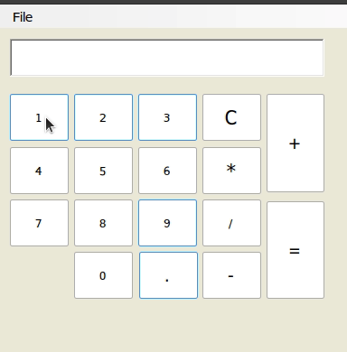

## Баг-репорт тестирования калькулятора

### кейс-1 Базовое тестирование

| № примера | Пример | Фактический результат | Ожидаемый результат |
| ------ | ------ | ------ | ------ |
| 1 | 12 + 5 | 17 | 17 |
| 2 | 12 - 5 | 7 | 7 |
| 3 | 12 * 5 | 60 | 60 |
| 4 | 12 / 5 | 2,4 | 2,4 |

### кейс-2 Тестируем большие числа

| № примера | Пример | Фактический результат | Ожидаемый результат |
| ------ | ------ | ------ | ------ |
| 1 | 123 457 899 * 2 | 246 915 798 | 246 915 798 |

	
## После тестирования у нас получился список ошибок : 

## кейс - 1
>### ID - 1. 
>### Название : Не выводит сообщение при делении на ноль.
>### Фактический результат : Не выводит сообщение при делении на ноль.
>### Ожидаемый результат : Нужно добавить сообщение об ошибке при делении на ноль.
>| № примера | Пример | Фактический результат | Ожидаемый результат |
>| ------ | ------ | ------ | ------ |
>| 1 | 9 / 0 | 0 | Вывод сообщения : Cant`t divide by zero |

## кейс - 2
>### ID - 2. 
>### Название : Не обрабатывает отрицательные числа.
>#### Деление :
>| № примера | Пример | Фактический результат | Ожидаемый результат |
>| ------ | ------ | ------ | ------ |
>| 1 | -15 / 5 | 3 | -3 |

>#### Умножение :
>| № примера | Пример | Фактический результат | Ожидаемый результат |
>| ------ | ------ | ------ | ------ |
>| 1 | -2 * 6 | 12 | -12 |

>#### Сложение :
>| № примера | Пример | Фактический результат | Ожидаемый результат |
>| ------ | ------ | ------ | ------ |
>| 1 | -4 + 0 | 4 | -4 |

>#### Вычитание :
>| № примера | Пример | Фактический результат | Ожидаемый результат |
>| ------ | ------ | ------ | ------ |
>| 1 | -2 - 33 | -31 | -35 |

## кейс - 3
>### ID - 3. 
>### Название : Запятая отображается только после нажатия цифры.
>### Фактический результат : Запятая  отображается только после нажатия цифры. 
>### Ожидаемый результат : Запятая должна отобразиться сразу после нажатия.
>

## кейс - 4
>### ID - 4.
>### Название : При нажатии на 6 исчезает все. 
>### Фактический результат : При нажатии на 6 исчезает все. 
>### Ожидаемый результат : Нажатие на 6 не должно приводить к исчезновению. Все цифры должны иметь одинаковое поведение.
>

## кейс - 5
>### ID - 5.
>### Название :  Отсутствуют скобки.
>### Фактический результат : Отсутсвуют скобки
>### Ожидаемый результат : Необходимо добавить возможность использования скобок для создания выражений.

## кейс - 6
>### ID - 6.
>### Название : Результат неккоректно обрабатывается.
>| № примера | Пример | Фактический результат | Ожидаемый результат |
>| ------ | ------ | ------ | ------ |
>| 1 | 12 - 1 = 11 - 1  | 0 | 10 |
>| 2 | 14 - 1 = 13 - 7  | -6 | 6 |

## кейс - 7
>### ID - 7.
>### Название : После получения результата нажатие на любую цифру выводит непонятные числа.
>### Фактический результат : После получения результата, нажатие на любую цифру выводит непонятные числа.
>### Ожидаемый результат : После получения результата, если нажать на цифру, предыдущее число должно исчезнуть.
>

## кейс - 8
>### ID - 8.
>### Название : Запятая ставится неоднократно.
>### Фактический результат : Запятую можно ставить сколько угодно.
>### Ожидаемый результат : Запятая должна ставиться только один раз.
>

## кейс - 9
>### ID - 9.
>### Название : Ошибка в UI
>### Шаги воспроизведения: 
>### 1. Запустить калькулятор
>### 2. Увеличить во весь экран
>### 3. Уменьшить
>### 4. Свернуть
>### 5. Снова открыть
>### Фактический результат : Окно отображается во весь экран после сворачивания и восстановления.
>### Ожидаемый результат : Окно должен сохранять свой последний вид перед сворачиванием.
>

## кейс - 10
>### ID - 10.
>### Название : Отсутствует фиксированный минимальный размер длины и ширины. 
>### Фактический результат : При сокращении длины или ширины калькулятор исчезает полностью.
>### Ожидаемый результат : Необходима фиксированная минимальная длина и ширина, чтобы все кнопки были видны.
>

## кейс - 11
>### ID - 11.
>### Название : Не соблюдает порядок действий
>### Фактический результат : Выполняет только последнее выражение.
>### Ожидаемый результат : Сначала выполняется умножение и деление, а затем — сложение и вычитание.
>| № примера | Пример | Фактический результат | Ожидаемый результат |
>| ------ | ------ | ------ | ------ |
>| 1 | 6 + 6 * 6 | 36 | 42 |
>| 2 | 17 + 85 * 4 | 340 | 357 |
>| 3 | 5 + 4 * 2 / 2 | 1 | 9 |

## кейс - 12
>### ID - 12.
>### Название : Стиль
>### Фактический результат : При увеличении размера калькулятор остается в левом боку. 
>### Ожидаемый результат : Калькулятор должен оставаться в центре.
>

## кейс - 13
>### ID - 13.
>### Название : Не принимает input из клавиатуры.
>### Фактический результат : Не принимает input из клавиатуры.
>### Ожидаемый результат : Должен принимать input из клавиатуры, либо полностью исключить возможность набирать из клавиатуры.
>

## кейс - 14
>### ID - 14.
>### Название : Неправильно показывает длинный input.
>### Фактический результат : Неправильно показывает длинный input.
>### Ожидаемый результат : Всегда должен показывать последнюю цифру.
>